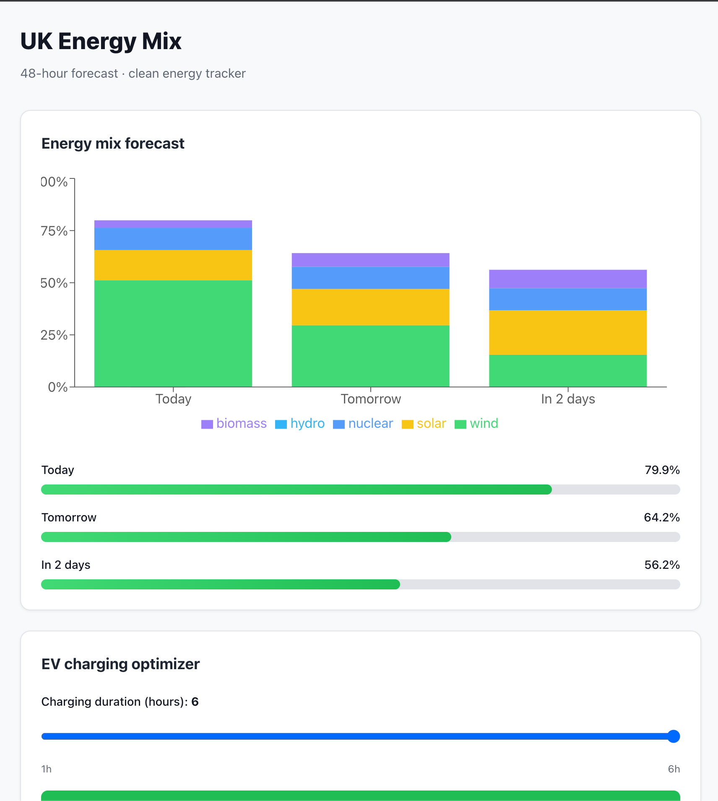
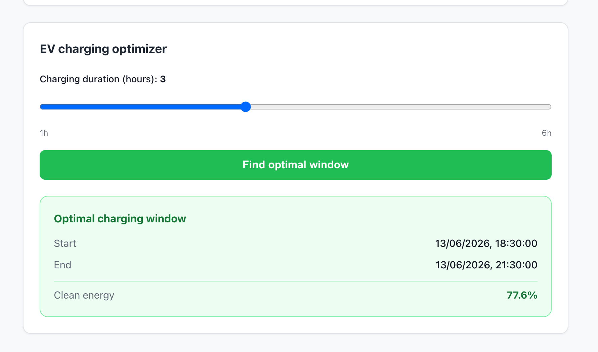

# UK Energy Mix

Web application showing the UK energy mix forecast for the next 48 hours and a calculator for the optimal EV charging window.

**Live demo:** [https://energy.pietrzak.czutka.uk](https://energy.pietrzak.czutka.uk)

---

## Screenshots





---

## Features

- Stacked bar chart of energy sources (wind, solar, nuclear, hydro, biomass) for today, tomorrow, and the day after
- Clean energy percentage bars per day
- EV charging optimizer — pick a duration (1–6 hours) and get the cleanest charging window in the next 48 hours

## Tech stack

React 18 · TypeScript · Vite · Recharts

---

## Local development

### Requirements

- Node.js 18+
- Backend API running on `http://localhost:8080` ([energymix](https://github.com/bpietrzakk/energy-mix-backend))

### Setup

```bash
# 1. Install dependencies
npm install

# 2. Start the dev server
npm run dev
```

Open [http://localhost:5173](http://localhost:5173).

The dev server proxies `/api/*` requests to `http://localhost:8080`, so the backend must be running first.

### Environment variables

| Variable | Default | Description |
|---|---|---|
| `VITE_API_BASE_URL` | ` ` (uses Vite proxy) | Full API base URL for production deployments |

Copy `.env.example` to `.env` and adjust if needed.

### Running tests

```bash
npm test
```

---

## Build

```bash
npm run build
```

Output goes to `dist/`. Set `VITE_API_BASE_URL` to the production API URL before building.

---

## Project structure

```
src/
├── api/          # Fetch functions for each endpoint
├── components/   # React components
├── types/        # TypeScript interfaces matching the API contract
└── App.tsx       # Root component and layout
docs/
├── decisions.md        # Architecture decision records
└── screenshots/        # App screenshots
```
